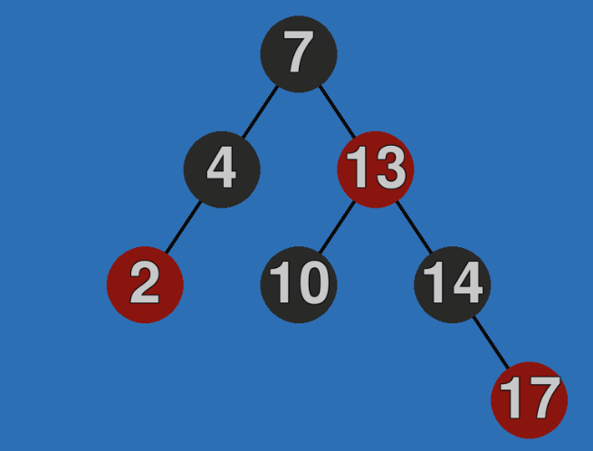

# Red-Black-Tree-Visualizer
## Web version: https://wisniewskij.github.io/Red-Black-Tree-Visualizer/ (give it a minute to load)

Interactive Red-Black Tree Visualizer using pygame and pygbag.

### Instructions

1. **Adding a Node**: 
   - Type a number (positive/negative integer) and press Enter.
2. **Deleting a Node**:
   - Click on the node you want to delete.
3. **Restarting the Workspace**:
   - Press **R**.
4. **Moving the Camera**:
   - Use the arrow keys and **M**, **N** keys.
5. **Centering the View**:
   - Press **Space**.
  

  

### Project uses
- pygame: https://www.pygame.org/
- pygame text-input module from: https://github.com/Nearoo/pygame-text-input
- pygbag: https://pypi.org/project/pygbag/
